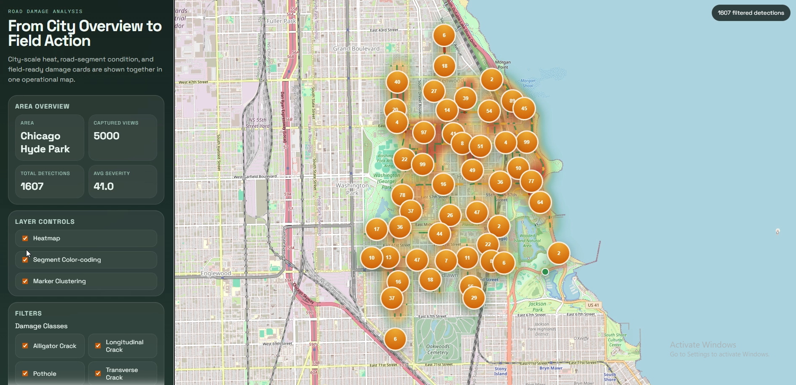
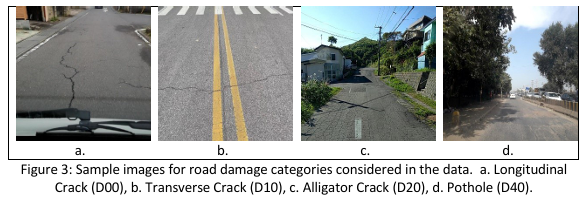

# 🛣️ Road Damage Analysis

**Road Damage Analysis** is an end-to-end Python pipeline for collecting road-facing Google Street View imagery, detecting pavement damage with a pretrained YOLOv8 model, and visualizing the results on an interactive web map.

Designed for road-condition monitoring workflows that need both:
- a **macro view** for identifying damaged hotspots across an area
- a **field view** for inspecting individual detections with image evidence

---

## 📸 Screenshots

| Dashboard |
|:---------:|
|  | 

| RDD2022 Damage Classes |
|:----------------------:|
|  |

---

## ✨ Key Features

- 🗺️ Road-aware Street View sampling using OSM road geometry
- ↔️ Forward and reverse road-direction image collection
- 🔁 Duplicate pano reduction with heading bucketing
- ✂️ Bottom watermark cropping before inference
- 🎯 Confidence filtering, test-time augmentation, and weighted box fusion
- 📍 Segment-level and point-level visualization on a web map
- 🔥 Marker clustering, heatmap rendering, and class-based filtering
- ⚙️ Config-driven presets for different target areas

---

## 🏗️ Project Structure

```
configs/                        YAML presets (default: configs/default.yaml)
src/road_damage_analysis/       application code
web/                            dashboard template
assets/                         README and project assets
data/raw/                       downloaded Street View images
data/processed/                 processed CSV and GeoJSON outputs
models/                         YOLO weights
```

> ⚠️ Do **not** commit `.env`, `data/raw/`, or large `.pt` model files.

---

## ⚙️ Requirements

- Python 3.10+
- Conda or Anaconda (recommended)
- A valid Google Street View API key
- A road-damage YOLO `.pt` model file

---

## 🚀 Local Setup

```bash
conda env create -f environment.yml
conda activate road-damage-analysis
copy .env.example .env
pip install -e .
```

**`.env` example:**

```env
GOOGLE_STREET_VIEW_API_KEY=your_google_street_view_api_key
MODEL_WEIGHTS_URL=replace_with_your_yolov8_road_damage_weights_url
MODEL_WEIGHTS_PATH=replace_with_your_local_yolov8_road_damage_weights_path
```

Set either `MODEL_WEIGHTS_URL` (downloadable `.pt` URL) or `MODEL_WEIGHTS_PATH` (local `.pt` path).

---

## ▶️ Running the Pipeline

**1. Collect imagery and run damage detection:**

```bash
road-damage-analysis collect-and-detect --config configs/default.yaml --download-limit 200
```

**2. Serve the dashboard:**

```bash
road-damage-analysis serve --config configs/default.yaml
```

**3. Open in browser:**

```
http://127.0.0.1:8000
```

---

## 🔍 YOLOv8 Inference Flow

This project uses the Ultralytics YOLOv8 Python API with a custom road-damage `.pt` model.

```
load weights (MODEL_WEIGHTS_PATH or MODEL_WEIGHTS_URL)
    ↓
crop bottom watermark band
    ↓
run inference on original image
    ↓
[optional] horizontal-flip TTA → convert back to original coords
    ↓
merge overlapping boxes with Weighted Box Fusion (WBF)
    ↓
filter by confidence threshold
    ↓
convert to damage scores for spatial aggregation
```

> Implementation: `src/road_damage_analysis/detection.py` via `YOLO(...).predict(...)` from the Ultralytics package.

---

## ⚙️ Configuration Notes

Config files live in `configs/` as YAML. Key fields:

| Field | Description |
|---|---|
| `imagery.bbox` | Target area bounding box |
| `imagery.road_sample_spacing_m` | Road sampling interval (meters) |
| `imagery.max_locations` | Metadata collection cap |
| `imagery.radius_m` | Street View pano search radius |
| `imagery.heading_bin_deg` | Duplicate heading bucket size |
| `imagery.pano_snap_max_distance_m` | Reject panos snapped too far from road |
| `model.conf_threshold` | Minimum confidence for final detections |
| `model.enable_tta` | Enable test-time augmentation |
| `model.enable_wbf` | Enable weighted box fusion |
| `model.crop_bottom_ratio` | Crop ratio for bottom watermark |

---

## 📂 Output Files

| File | Description |
|---|---|
| `data/raw/<area_slug>/google_street_view_images/` | Downloaded Street View images |
| `data/processed/damage_detections.csv` | Per-image detection results |
| `data/processed/damage_segment_summary.csv` | Aggregated segment summaries |
| `data/processed/damage_detections.geojson` | Point-level GeoJSON |
| `data/processed/damage_segments.geojson` | Segment-level GeoJSON |
| `data/processed/summary.json` | Overall summary statistics |

---

## ⚖️ License

This project is licensed under the **[GNU AGPL-3.0 License](LICENSE)**.

Because this project integrates and runs [Ultralytics YOLOv8](https://github.com/ultralytics/ultralytics), which is itself licensed under **AGPL-3.0**, the entirety of this repository is subject to the same open-source copyleft terms.

> ⚠️ **Commercial Use:** For commercial use outside of the AGPL-3.0 terms, an **Enterprise License from Ultralytics** is required. See [Ultralytics Licensing](https://ultralytics.com/license) for details.

The **RDD2022 Dataset**, on which the default YOLOv8 weights are trained, is licensed under **[CC BY-SA 4.0](https://creativecommons.org/licenses/by-sa/4.0/)**.

---

## 🔏 Data, Rights & Copyright

This project depends on third-party data sources and model assets. You are responsible for reviewing and complying with their respective licenses and terms of use before publishing, redistributing, or deploying.

### Google Street View

> ⛔ **Google's Terms of Service strictly prohibit using their Maps or imagery data to create or train machine learning models.**

This project performs **inference only** on downloaded imagery. You must **not** use downloaded Street View images to fine-tune or train new models.

Before any public release, verify:
- Whether you may store and republish downloaded Street View images
- Whether public hosting of derived outputs is permitted
- Whether commercial use is allowed for your intended use case

### OpenStreetMap

Road geometry data is sourced from OpenStreetMap and is subject to the **[Open Database License (ODbL)](https://opendatacommons.org/licenses/odbl/)**.

### Model Weights

The YOLOv8 road-damage weights are derived from [`oracl4/RoadDamageDetection`](https://github.com/oracl4/RoadDamageDetection), trained on the RDD2022 dataset. Use in accordance with that repository's license and the upstream **CC BY-SA 4.0** restrictions.

---

## 🔬 Model Source

YOLOv8 road-damage weights used in this project are derived from:

> **[oracl4/RoadDamageDetection](https://github.com/oracl4/RoadDamageDetection)**  
> YOLOv8 models trained on the RDD2022 dataset (e.g., `YOLOv8_Small_RDD.pt`)

---

## 📚 References

1. Ultralytics YOLOv8 — [GitHub](https://github.com/ultralytics/ultralytics) · [Prediction Docs](https://docs.ultralytics.com/modes/predict/)
2. RDD2022 Dataset — [arXiv:2209.08538](https://arxiv.org/abs/2209.08538)
3. Road-damage YOLOv8 weights — [oracl4/RoadDamageDetection](https://github.com/oracl4/RoadDamageDetection)

---

## 📖 Citation

If you use the Road Damage Detection 2022 data or models derived from it, please cite:

```bibtex
@inproceedings{arya2022crowdsensing,
  title     = {Crowdsensing-based Road Damage Detection Challenge (CRDDC'2022)},
  author    = {Arya, Deeksha and Maeda, Hiroya and Ghosh, Sanjay Kumar and Toshniwal, Durga and Omata, Hiroshi and Kashiyama, Takehiro and Sekimoto, Yoshihide},
  booktitle = {2022 IEEE International Conference on Big Data (Big Data)},
  pages     = {6378--6386},
  year      = {2022},
  organization = {IEEE}
}

@article{arya2022rdd2022,
  title   = {RDD2022: A multi-national image dataset for automatic Road Damage Detection},
  author  = {Arya, Deeksha and Maeda, Hiroya and Ghosh, Sanjay Kumar and Toshniwal, Durga and Sekimoto, Yoshihide},
  journal = {arXiv preprint arXiv:2209.08538},
  year    = {2022}
}

@article{arya2021deep,
  title     = {Deep learning-based road damage detection and classification for multiple countries},
  author    = {Arya, Deeksha and Maeda, Hiroya and Ghosh, Sanjay Kumar and Toshniwal, Durga and Mraz, Alexander and Kashiyama, Takehiro and Sekimoto, Yoshihide},
  journal   = {Automation in Construction},
  volume    = {132},
  pages     = {103935},
  year      = {2021},
  publisher = {Elsevier}
}

@article{arya2021rdd2020,
  title     = {RDD2020: An annotated image dataset for automatic road damage detection using deep learning},
  author    = {Arya, Deeksha and Maeda, Hiroya and Ghosh, Sanjay Kumar and Toshniwal, Durga and Sekimoto, Yoshihide},
  journal   = {Data in brief},
  volume    = {36},
  pages     = {107133},
  year      = {2021},
  publisher = {Elsevier}
}

@inproceedings{arya2020global,
  title        = {Global road damage detection: State-of-the-art solutions},
  author       = {Arya, Deeksha and Maeda, Hiroya and Ghosh, Sanjay Kumar and Toshniwal, Durga and Omata, Hiroshi and Kashiyama, Takehiro and Sekimoto, Yoshihide},
  booktitle    = {2020 IEEE International Conference on Big Data (Big Data)},
  pages        = {5533--5539},
  year         = {2020},
  organization = {IEEE}
}
```
